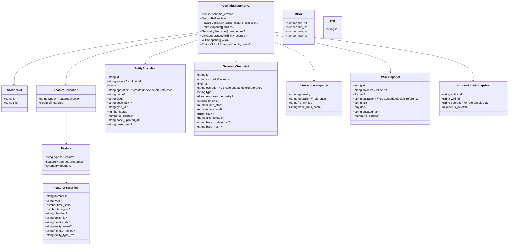

# Commit Snapshot (`commits.snapshot_json`) - Cấu Trúc Hiện Tại

Tài liệu này mô tả **commit snapshot** đang được lưu trong `BackEndGo.commits.snapshot_json` (JSONB) và được `FrontEndAdmin` tạo ra khi bấm **Commit** trong `/editor`.

Mục tiêu: nhìn vào đây là hiểu commit snapshot gồm những phần nào, ý nghĩa ra sao, và `source`/`operation` có vai trò gì.

Nguồn tham chiếu trong code:

- Type snapshot: `FrontEndAdmin/src/uhm/types/sections.ts` (`EditorSnapshot`)
- Build snapshot khi commit: `FrontEndAdmin/src/uhm/lib/editor/snapshot/editorSnapshot.ts` (`buildEditorSnapshot`)

## 1) Schema tổng quan (v1)

Hiện tại snapshot được ghi với `schema_version: 1`.

```ts
export type CommitSnapshotV1 = {
  schema_version: 1;

  // Project/section đang được edit (FE vẫn giữ tên "section" cho compatibility)
  section: { id: string; title: string };

  // GeoJSON draft để render map + làm nguồn dựng geometries/link_scopes
  editor_feature_collection?: FeatureCollection;

  // Operation-based rows
  entities?: EntitySnapshot[];
  geometries?: GeometrySnapshot[];
  link_scopes?: LinkScopeSnapshot[];

  // Wiki list (tiptap JSON hoặc reference)
  wikis?: WikiSnapshot[];

  // Join table inside snapshot: links between entities and wikis (project-level)
  entity_wikis?: EntityWikiLinkSnapshot[];
};
```

## 2) `operation` có những giá trị nào?

Trong commit snapshot hiện tại có 4 nơi dùng `operation`:

1. `entities[].operation`:

- `create` | `update` | `delete` | `reference`

2. `geometries[].operation`:

- `create` | `update` | `delete` | `reference`

3. `link_scopes[].operation`:

- `reference`

4. `wikis[].operation`:

- `create` | `update` | `delete` | `reference`

Ghi chú về semantics:

- `create/update/delete`: bản ghi bị thay đổi trong commit này
- `reference`: bản ghi được đưa vào snapshot để làm đầu mối **nối (link)** (vd: geometry↔entity, entity↔wiki), không phải “không đổi”

Ngoài ra snapshot có `entity_wikis[]` để nối entity <-> wiki.

## 3) Sơ đồ trực quan (Mermaid)



## 4) Ý nghĩa từng phần

### 4.1 `section`

Chỉ là “ref” tối thiểu để biết commit này thuộc project nào:

- `section.id` = `project_id`
- `section.title` = title tại thời điểm commit (phục vụ UI)

### 4.2 `editor_feature_collection`

GeoJSON `FeatureCollection` là nguồn để:

- render map trong editor
- build `geometries[]` + `link_scopes[]` khi commit

Trong thực tế, nó là “bản đồ draft state” của commit.

### 4.3 `entities[]`

`entities[]` là tập các entity rows kèm `source`/`operation`. Trong `buildEditorSnapshot` hiện tại, nó được dựng từ:

1. `pending entities` tạo trong editor:
   - `source: "inline"`, `operation: "create"`
2. `projectEntityRefs` (entity được user “pin” vào project từ thanh search):
   - `source: "ref"`, `ref: {id}`, `operation: "reference"`
3. Các entity IDs đang được gắn vào geometries trong `editor_feature_collection` (nếu chưa có trong list):
   - `source: "ref"`, `ref: {id}`, `operation: "reference"`
4. Các entity IDs xuất hiện trong `entity_wikis[]`:
   - `source: "ref"`, `ref: {id}`, `operation: "reference"`

=> Nghĩa là: `entities[]` trong commit snapshot hiện tại hoạt động như một “danh sách entity liên quan tới project”, không nhất thiết phải gắn vào một geometry cụ thể.

### 4.4 `geometries[]`

Mỗi `Feature` trong `editor_feature_collection.features[]` sẽ sinh ra một `GeometrySnapshot` row:

- `id`: `String(feature.properties.id)`
- `draw_geometry`: lấy từ `feature.geometry`
- `type`: `feature.properties.type || getDefaultTypeIdForFeature(feature)`
- `binding`: normalize từ `feature.properties.binding`
- `time_start/time_end`
- `bbox`: tính từ geometry
- `is_deleted: 0`

`operation` được suy ra dựa vào `changes` + so sánh với snapshot trước:

- `create`: feature mới
- `update`: feature thay đổi
- (không có `operation`): feature không đổi (không delta trong commit)
- `delete`: feature bị xoá khỏi draft (FE sẽ thêm 1 row `{ id, operation:"delete", is_deleted:1 }`)

### 4.5 `link_scopes[]`

FE build link scopes từ GeoJSON features:

- `geometry_id = String(feature.properties.id)`
- `operation = "reference"`
- `entity_ids` lấy từ `feature.properties.entity_ids` hoặc `entity_id`

Chỉ add scope nếu `entity_ids.length > 0`.

### 4.6 `wikis[]`

`wikis[]` là danh sách wiki của project tại thời điểm commit.

Type hiện tại:

```ts
export type WikiSnapshot = {
  id: string;
  source?: "inline" | "ref";
  ref?: { id: string };
  operation?: "create" | "update" | "delete" | "reference";
  title: string;
  doc: unknown; // tiptap JSON doc (inline) hoặc null (reference)
  updated_at?: string;
  is_deleted?: number;
};
```

Quy ước FE đang dùng:

- Wiki tạo mới trong editor: `operation: "create"`, `doc` là tiptap JSON.
- Wiki sửa: `operation: "update"`, `doc` là tiptap JSON.
- Wiki không đổi so với snapshot trước: thường **không có** `operation` (không delta).
- Wiki add từ thanh search (wiki đã tồn tại trong DB): `source:"ref"`, `ref:{id}`, `operation:"reference"`, **`doc` có thể là `null`**.

Ghi chú quan trọng:

- Hiện tại FE **chưa generate “delete rows” cho wikis** (khác với geometries). Khi bạn remove một wiki khỏi list thì snapshot mới sẽ đơn giản là không còn wiki đó nữa.

### 4.7 `entity_wikis[]` (bảng nối Entity ↔ Wiki)

`entity_wikis[]` là bảng nối trong snapshot để thể hiện “wiki nào thuộc entity nào” ở mức project/commit.

```ts
export type EntityWikiLinkSnapshot = {
  entity_id: string;
  wiki_id: string;
  operation?: "reference" | "delete";
  is_deleted?: number;
};
```

FE hiện dùng panel “Entity ↔ Wiki” để toggle link:

- Tick checkbox => `{ operation:"reference", is_deleted:0 }`
- Untick checkbox => `{ operation:"delete", is_deleted:1 }`

## 5) Ví dụ JSON (rút gọn)

Ví dụ dưới đây thể hiện:

- 1 geometry gắn entity `e_1`
- 1 entity ref “pin” vào project (`e_2`) dù chưa gắn geometry
- 1 wiki inline và 1 wiki reference (search từ DB)

```json
{
  "schema_version": 1,
  "section": { "id": "019d...project", "title": "Project A" },
  "editor_feature_collection": {
    "type": "FeatureCollection",
    "features": [
      {
        "type": "Feature",
        "properties": {
          "id": "g_1",
          "type": "city",
          "time_start": 1200,
          "time_end": 1300,
          "entity_ids": ["e_1"],
          "entity_names": ["Ha Noi"]
        },
        "geometry": { "type": "Point", "coordinates": [105.8, 21.0] }
      }
    ]
  },
  "entities": [
    { "id": "e_2", "operation": "reference", "name": "Pinned Entity", "is_deleted": 0 },
    { "id": "e_1", "operation": "reference", "name": "Ha Noi", "type_id": "city", "status": 1, "is_deleted": 0 }
  ],
  "geometries": [
    {
      "id": "g_1",
      "operation": "update",
      "type": "city",
      "draw_geometry": { "type": "Point", "coordinates": [105.8, 21.0] },
      "binding": [],
      "time_start": 1200,
      "time_end": 1300,
      "bbox": { "min_lng": 105.8, "min_lat": 21.0, "max_lng": 105.8, "max_lat": 21.0 },
      "is_deleted": 0
    }
  ],
  "link_scopes": [{ "geometry_id": "g_1", "operation": "reference", "entity_ids": ["e_1"] }],
  "wikis": [
    {
      "id": "w_inline_1",
      "source": "inline",
      "operation": "create",
      "title": "Overview",
      "doc": { "type": "doc", "content": [{ "type": "paragraph" }] }
    },
    {
      "id": "019d...wiki_from_db",
      "source": "ref",
      "ref": { "id": "019d...wiki_from_db" },
      "operation": "reference",
      "title": "Existing Wiki (DB)",
      "doc": null
    }
  ],
  "entity_wikis": [
    { "entity_id": "e_1", "wiki_id": "w_inline_1", "operation": "reference", "is_deleted": 0 }
  ]
}
```

## 6) Các điểm cần chốt khi muốn đi xa hơn với “ref”

Để `source:"ref"` thực sự “lấy từ bên ngoài snapshot”, cần thống nhất:

1. Wiki DB format:
- BackEndGo `wikis.content` hiện là `TEXT`, trong khi editor wiki dùng TipTap JSON (`doc`).
- Nếu muốn `ref` load content khi cần, phải chốt format lưu trữ (JSON string / HTML / Markdown).

2. Semantics `operation:"reference"`:
- `reference` được dùng theo nghĩa “đầu mối để nối (link)” và thường đi kèm `source:"ref"` (ref tới DB/global).
- Các bản ghi inline không thay đổi nên **không có `operation`** (không delta).
