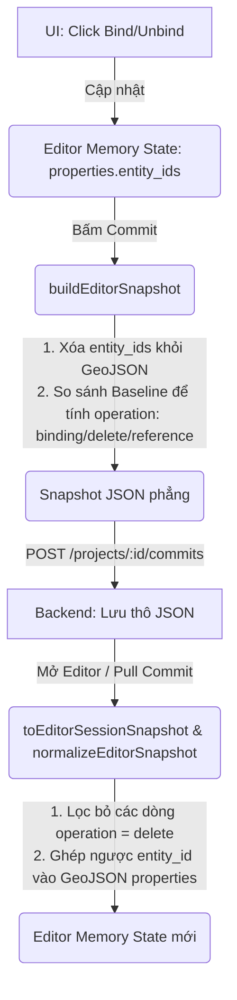

# UHM Editor - Luồng Dữ Liệu Commit và Load Snapshot (FrontEnd)

Tài liệu này giải thích chi tiết vòng đời của dữ liệu liên kết (binding) giữa **Geometry** và **Entity** trên FrontEnd (FE), từ lúc người dùng thao tác trên giao diện, đóng gói gửi lên API (Commit), cho đến khi tải ngược lại từ API về Editor (Load).

---

## 1. Sơ đồ tổng quan luồng dữ liệu

---

## 2. Các giai đoạn chi tiết

### Giai đoạn 1: Editor Runtime State (Đang chỉnh sửa)
Khi người dùng đang mở Editor, dữ liệu liên kết được lưu trực tiếp trong thuộc tính của đối tượng hình học (GeoJSON Feature Properties) để hiển thị nhanh trên bản đồ:
- `feature.properties.entity_ids`: Mảng chứa các ID của thực thể đang liên kết (Ví dụ: `["entity-uuid-1", "entity-uuid-2"]`).
- `feature.properties.entity_id`: ID của thực thể chính (thường là phần tử đầu tiên).

### Giai đoạn 2: Trước khi gửi Commit (Build Snapshot)
Để đảm bảo cơ sở dữ liệu snapshot gọn nhẹ và không bị dư thừa dữ liệu (normalized database), hàm `buildEditorSnapshot()` sẽ thực hiện hai việc quan trọng:

1. **Xóa thuộc tính liên kết trong GeoJSON:**
   Trước khi lưu `editor_feature_collection`, FE sẽ **xóa sạch** các trường động như `entity_id`, `entity_ids`, `entity_name`, `entity_names` khỏi thuộc tính của Feature. Do đó, phần GeoJSON lưu trong snapshot **không chứa** thông tin liên kết thực thể.
   
2. **Chuyển đổi thành bảng liên kết phẳng (`geometry_entity[]`):**
   FE so sánh danh sách liên kết hiện tại trong draft với **Baseline** (dữ liệu của commit trước đó) để tính toán cờ hành động (`operation`) cho từng cặp liên kết:
   - **`binding` (Tạo mới):** Có trong draft hiện tại nhưng **không có** trong baseline.
   - **`reference` (Không đổi):** Có trong cả draft hiện tại và baseline.
   - **`delete` (Xóa bỏ):** **Có** trong baseline cũ nhưng **không còn** trong draft hiện tại.

### Giai đoạn 3: Gửi và lưu trữ trên Backend
1. FE đóng gói snapshot này vào trường `snapshot_json` và gửi tới API: `POST /projects/{id}/commits`.
2. Backend nhận được JSON này và lưu trữ nguyên vẹn vào cột `snapshot_json` của bảng `commits`. 

*(Lưu ý: Backend hiện tại chưa xử lý cờ `delete` để cập nhật bảng liên kết vật lý `entity_geometries` dưới Database gốc khi duyệt commit, dẫn đến lỗi bất đồng bộ mà bạn đang gặp).*

### Giai đoạn 4: Tải Commit về (Load / Hydrate)
Khi Editor được mở lại hoặc pull commit mới nhất về, FE nhận được `snapshot_json` từ API. Hàm `toEditorSessionSnapshot()` và `normalizeEditorSnapshot()` sẽ thực hiện ngược lại:

1. **Lọc bỏ dòng đã xóa:**
   Duyệt qua mảng `geometry_entity`, nếu gặp dòng có `operation === "delete"`, FE sẽ **bỏ qua ngay lập tức** (không nạp dòng này vào bộ nhớ baseline mới).
   
2. **Tái hợp nhất (Hydrate) vào GeoJSON:**
   Duyệt qua các liên kết hợp lệ còn lại, nhóm chúng theo `geometry_id`, sau đó gán ngược danh sách `entity_ids` vào các Feature GeoJSON tương ứng để Editor có thể vẽ liên kết lên bản đồ.

---

## 3. Bảng tóm tắt trạng thái các cờ `operation`

| Trạng thái liên kết | Draft hiện tại | Baseline trước đó | Cờ `operation` trong Snapshot | FE xử lý khi Load |
| :--- | :---: | :---: | :---: | :--- |
| **Liên kết cũ giữ nguyên** | Có | Có | `reference` | Nạp vào bộ nhớ |
| **Tạo liên kết mới** | Có | Không | `binding` | Nạp vào bộ nhớ |
| **Gỡ liên kết cũ (Unbind)** | Không | Có | `delete` | **Bỏ qua (Không nạp)** |

---

## 4. Tại sao cơ chế này đôi khi gây bối rối?
- **Khác biệt giữa Snapshot JSON và DB gốc:** Snapshot JSON lưu trữ cả lịch sử thay đổi (cờ `delete`), trong khi Database gốc chỉ lưu trạng thái thực tế cuối cùng. Do đó, đọc trực tiếp API snapshot sẽ thấy dòng có cờ `delete`, nhưng chạy code FE hoặc DB đã duyệt thì liên kết đó phải mất đi.
- **Tính một lần (One-time instruction):** Dòng `"delete"` chỉ xuất hiện **đúng 1 lần** trong snapshot của commit thực hiện hành động xóa. Ở commit tiếp theo, do baseline đã lọc bỏ dòng này từ trước, nên diff sẽ không sinh ra dòng `"delete"` đó nữa.
