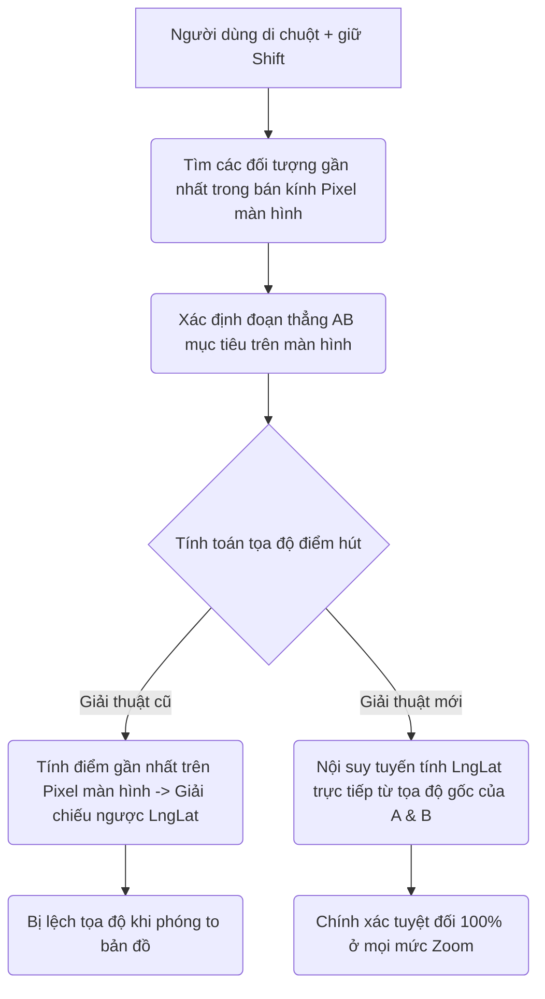

# Cơ Chế Hút Điểm Khi Vẽ (Snapping Precision)

Tài liệu này giải thích chi tiết về cơ chế hoạt động của tính năng hút điểm (**Snapping**) khi người dùng vẽ hoặc chỉnh sửa các đối tượng địa lý (Point, LineString, Polygon) trên bản đồ lịch sử. Đồng thời so sánh giải thuật cũ (Pixel Space) và giải thuật mới (LngLat Space) để đảm bảo độ chính xác tuyệt đối ở mọi mức Zoom.

---

## 1. Giới thiệu Tính năng Snapping
Khi vẽ biên giới, tuyến đường hành quân hoặc định vị địa điểm, người dùng có thể nhấn giữ phím **`Shift`** hoặc **`Alt`** để tự động hút điểm vẽ hiện tại vào các đối tượng địa lý sẵn có trên bản đồ (như bờ biển, biên giới quốc gia lân cận, hoặc các điểm di tích).

Tính năng này giúp:
- Tránh các khe hở (gaps) hoặc chồng chéo (overlaps) giữa các vùng lãnh thổ giáp ranh.
- Giảm thiểu thời gian và công sức vẽ tay thủ công khi đi theo các đường biên phức tạp.

---

## 2. Vấn đề của giải thuật cũ (Pixel Space)

### Cách thức hoạt động cũ:
1. Chiếu các đỉnh của bản đồ gốc từ Kinh/Vĩ độ (`LngLat`) lên hệ tọa độ màn hình (`Pixel` - $x, y$).
2. Tìm điểm pixel gần nhất trên đoạn thẳng pixel tương ứng với con trỏ chuột.
3. Giải chiếu ngược (`map.unproject`) điểm pixel đó thành tọa độ địa lý `LngLat` để lưu trữ.

### Nhược điểm:
* **Sai số tỉ lệ theo mức Zoom:** Ở mức zoom nhỏ (nhìn từ xa), một đoạn biên giới ngoài đời thực dài hàng trăm kilômét chỉ hiển thị ngắn ngủi vài pixel trên màn hình.
* **Lệch tọa độ khi phóng to:** Sai số làm tròn pixel lúc vẽ ở zoom nhỏ sẽ phóng đại lên thành sai số hàng nghìn mét ngoài thực địa khi người dùng phóng to bản đồ (zoom lớn). Hai quốc gia giáp ranh vẽ ở zoom nhỏ sẽ bị hở hoặc đè lên nhau khi zoom cận cảnh.

---

## 3. Giải thuật mới: Tính toán trên không gian Kinh/Vĩ độ gốc (LngLat Space)

Để khắc phục hoàn toàn hiện tượng lệch tọa độ, giải thuật mới kết hợp cả **Pixel Space** (để lọc tương tác) và **LngLat Space** (để tính toán tọa độ chốt).

### Các bước thực hiện chi tiết:

1. **Bước 1: Lọc đối tượng gần màn hình**
   Hệ thống sử dụng khoảng cách pixel để xác định đối tượng mà người dùng đang trỏ tới (ví dụ: nằm trong phạm vi `24px` đến `34px` trên màn hình). Điều này đảm bảo tính năng hoạt động đúng theo cảm quan của mắt người dùng.

2. **Bước 2: Xác định đoạn thẳng mục tiêu**
   Hệ thống xác định đoạn thẳng nối hai đỉnh gốc $A(lng_A, lat_A)$ và $B(lng_B, lat_B)$ của đối tượng đích.

3. **Bước 3: Chiếu điểm trực tiếp trên không gian LngLat**
   Để tính toán chính xác điểm gần nhất $C(lng_C, lat_C)$ nằm trên đoạn thẳng $AB$, hệ thống thực hiện phép chiếu vector trong không gian tọa độ địa lý địa phương, có bù trừ độ cong kinh tuyến dựa vào vĩ độ trung bình ($\cos(lat)$):
   
   $$\text{lat}_{\text{rad}} = \frac{lat_A + lat_B + lat_{\text{cursor}}}{3} \times \frac{\pi}{180}$$
   $$\text{cos}_{\text{lat}} = \cos(\text{lat}_{\text{rad}})$$

   Chuyển đổi tạm thời sang hệ tọa độ phẳng cục bộ:
   $$x_A = lng_A \times \text{cos}_{\text{lat}}, \quad y_A = lat_A$$
   $$x_B = lng_B \times \text{cos}_{\text{lat}}, \quad y_B = lat_B$$
   $$x_P = lng_{\text{cursor}} \times \text{cos}_{\text{lat}}, \quad y_P = lat_{\text{cursor}}$$

   Tính tham số nội suy $t$ ($0 \le t \le 1$) của điểm hình chiếu trên đoạn thẳng $AB$:
   $$dx = x_B - x_A, \quad dy = y_B - y_A$$
   $$t = \max\left(0, \min\left(1, \frac{(x_P - x_A)dx + (y_P - y_A)dy}{dx^2 + dy^2}\right)\right)$$

   Nội suy tọa độ LngLat chính xác của điểm chốt:
   $$lng_C = a[0] + (b[0] - a[0]) \times t$$
   $$lat_C = a[1] + (b[1] - a[1]) \times t$$

---

## 4. Ưu điểm vượt trội của Giải thuật mới
* **Độ chính xác tuyệt đối:** Điểm chốt luôn nằm **collinear (thẳng hàng/nội suy tuyến tính)** hoàn hảo giữa hai đỉnh $A$ and $B$ gốc của bản đồ với độ chính xác số thực dấu phẩy động 64-bit.
* **Độc lập với Zoom:** Dù bạn vẽ ở Zoom nhỏ nhất (mức 2 - toàn cầu) hay Zoom lớn nhất (mức 18 - cận cảnh), đường vẽ mới vẫn sẽ khít khịt với đường biên cũ mà không xuất hiện bất kỳ sai số hay khe hở nào.
* **Tối ưu trải nghiệm:** Người dùng có thể bao quát toàn bộ bản đồ quốc gia lớn để vẽ nhanh mà vẫn đạt được độ chuẩn xác tuyệt đối như khi phóng to cận cảnh để chỉnh sửa.

---

## 5. Chỉ báo Màu sắc Hút điểm (Snapping Color Indicators)
Để tăng tính tương tác và giúp người dùng kiểm soát chính xác điểm vẽ đang hút vào đâu, hệ thống tự động đổi màu sắc của **đỉnh đang được kéo** (dragged handle) trong chế độ chỉnh sửa:

| Trạng thái Snap | Màu sắc hiển thị | Mã màu HEX | Ý nghĩa |
| :--- | :---: | :---: | :--- |
| **Hút vào Đỉnh (Vertex)** | Xanh lá | `#22c55e` | Điểm đang kéo trùng khít với một đỉnh mốc cũ của đối tượng địa lý khác. |
| **Hút vào Cạnh (Edge)** | Vàng | `#eab308` | Điểm đang kéo nằm hoàn hảo trên đường nối giữa hai đỉnh của đối tượng địa lý khác. |
| **Không hút (None)** | Xanh dương | `#3b82f6` | Điểm đang kéo tự do, không dính vào bất kỳ đối tượng nào (hoặc không nhấn Shift). |
| **Chế độ xóa hàng loạt** | Đỏ | `#ef4444` | Toàn bộ các đỉnh chuyển sang màu đỏ khi bạn bật chế độ xóa đỉnh bằng phím `Delete`. |
