# Goong Map Web Structure

Nguồn JSON gốc được tải về tại:

- `FrontEndUser/tmp/goong-styles/goong_map_web.json`

File này là style vector/label đầy đủ hơn, phù hợp để dò:

- water và water labels
- boundary theo cấp
- place labels cho lịch sử

## Mermaid overview

```mermaid
graph TD
  ROOT[goong_map_web.json]

  ROOT --> S1[source: base]
  ROOT --> S2[source: composite]

  S1 --> B1[source-layer: boundary]
  S1 --> B2[source-layer: worldcountriespoints]
  S1 --> B3[source-layer: worldnationalcapitals]

  S2 --> C1[source-layer: riversandlakes]
  S2 --> C2[source-layer: rivernames]
  S2 --> C3[source-layer: lakenames]
  S2 --> C4[source-layer: vietnam_administrator]
  S2 --> C5[source-layer: streets_label]

  B1 --> BL0[boundary-land-type-0 / type-0-bg]
  B1 --> BL1[boundary-land-type-1 / type-1-bg]
  B1 --> BL2[boundary-land-type-2 / type-2-bg]

  B2 --> PC1[place-country-1]
  B2 --> PC2[place-country-2]

  B3 --> CAP0[place-city-capital]

  C1 --> W1[water]
  C1 --> W2[water-shadow]

  C2 --> RN0[river-name-0]
  C2 --> RN1[river-name-1]
  C2 --> RN2[river-name-2]

  C3 --> LN0[lake-name_priority_0]
  C3 --> LN1[lake-name_priority_1]
  C3 --> LN2[lake-name_priority_2]

  C4 --> VA0[place-city-capital-vietnam]
  C4 --> VA1[place-city1 / place-city2]
  C4 --> VA2[place-town1 / place-town2]
  C4 --> VA3[place-suburb / borough / neighbourhood]
  C4 --> VA4[place-village]

  C5 --> RD0[highway-name-minor]
  C5 --> RD1[highway-name-medium]
  C5 --> RD2[highway-name-major]
```

## Boundary layers

Các layer boundary nổi bật:

- `boundary-land-type-0-bg`
- `boundary-land-type-0`
- `boundary-land-type-1-bg`
- `boundary-land-type-1`
- `boundary-land-type-2-bg`
- `boundary-land-type-2`

Minzoom quan sát được:

- `type-0`: từ zoom `1`
- `type-1`: từ zoom `5`
- `type-2-bg`: từ zoom `7`
- `type-2`: từ zoom `13`

Suy luận thực dụng:

- `type-0` có khả năng là biên giới quốc gia
- `type-1` có khả năng là cấp tỉnh/thành
- `type-2` có khả năng là cấp sâu hơn

## Water layers

Water fill:

- `water`
- `water-shadow`

Water labels:

- `river-name-0`
- `river-name-1`
- `river-name-2`
- `lake-name_priority_0`
- `lake-name_priority_1`
- `lake-name_priority_2`

## Place labels

Những label đáng quan tâm cho historical use:

- `place-country-1`
- `place-country-2`
- `place-city-capital`
- `place-city-capital-vietnam`
- `place-city1`
- `place-city2`
- `place-town1`
- `place-town2`

Những label dễ gây rối nếu bật nhiều:

- `highway-name-*`
- `place-suburb*`
- `place-neighbourhood*`
- `place-village`

## Gợi ý mapping cho UI

- `Country Borders` -> `boundary-land-type-0` + `boundary-land-type-0-bg`
- `Province Borders` -> `boundary-land-type-1` + `boundary-land-type-1-bg`
- `District Borders` -> `boundary-land-type-2` + `boundary-land-type-2-bg`
- `Country Labels` -> `place-country-*`, `place-city-capital*`, `place-city*`, `place-town*`
- `Rivers` -> `water`, `water-shadow`, `river-name-*`, `lake-name_*`
