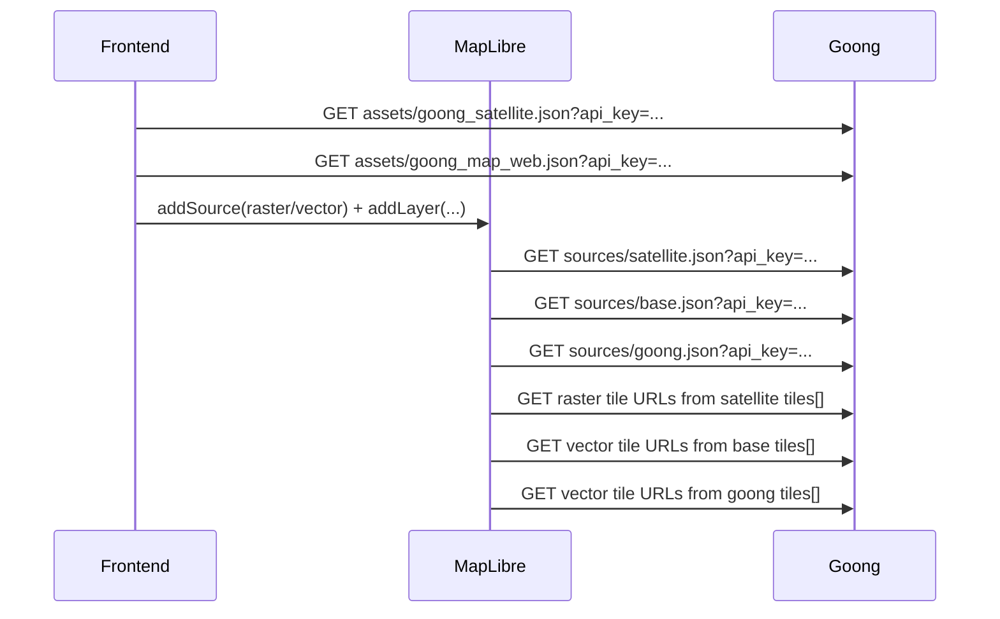
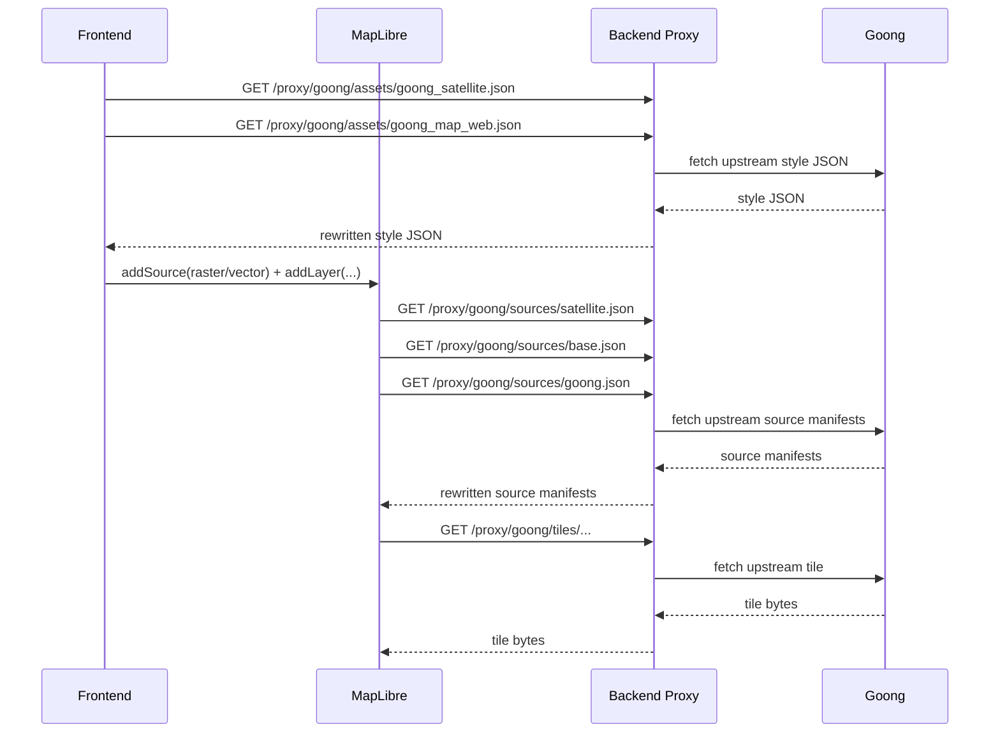

# Goong Proxy Backend Guide

Tài liệu này mô tả:

- luồng request thật của frontend hiện tại
- backend cần proxy chỗ nào
- backend cần rewrite chỗ nào
- trade-off hiệu suất nếu proxy/rewrite toàn bộ Goong
- khuyến nghị triển khai thực dụng cho team BE

Tài liệu liên quan:

- [goong_apis_in_use.md](/home/amoratran/wsp/ultimate-history-map/FrontEndUser/src/uhm/doc/goong_apis_in_use.md)
- [goong_map_web_structure.md](/home/amoratran/wsp/ultimate-history-map/FrontEndUser/src/uhm/doc/goong_map_web_structure.md)
- [goong_satellite_structure.md](/home/amoratran/wsp/ultimate-history-map/FrontEndUser/src/uhm/doc/goong_satellite_structure.md)

Code liên quan:

- [config.ts](/home/amoratran/wsp/ultimate-history-map/FrontEndUser/src/uhm/api/config.ts:1)
- [tiles.ts](/home/amoratran/wsp/ultimate-history-map/FrontEndUser/src/uhm/api/tiles.ts:1)
- [useMapLayers.ts](/home/amoratran/wsp/ultimate-history-map/FrontEndUser/src/uhm/components/map/useMapLayers.ts:1)

## 1. Bối cảnh hiện tại

Frontend hiện tại không `setStyle(goongStyle)` trực tiếp cho MapLibre.

Thay vào đó:

1. FE tự `fetch()` style JSON của Goong
2. FE parse style JSON
3. FE lấy ra:
   - raster source cho satellite
   - selected vector sources/layers cho borders, labels, rivers
4. FE `addSource()` và `addLayer()` thủ công
5. MapLibre tự request tiếp `source.url`
6. Từ source manifest, MapLibre tự request tiếp các tile URLs trong `tiles[]`

Điểm quan trọng:

- browser có thể không chỉ gọi `assets/*.json`
- browser sẽ đi sâu thêm ít nhất 2 tầng:
  - `sources/*.json`
  - tile URLs trong `tiles[]`

## 2. Luồng request hiện tại

## 3. Mục tiêu của backend proxy

Nếu mục tiêu là:

- không lộ `api_key` ở browser
- vẫn giữ frontend hiện tại gần như nguyên

thì backend phải đảm bảo:

1. browser chỉ gọi domain BE
2. BE gọi Goong bằng key server-side
3. mọi URL Goong lồng bên trong JSON đều được rewrite về domain BE

Nếu thiếu bước 3:

- `api_key` vẫn có thể lộ ở request tầng sau

## 4. Những gì cần rewrite

### 4.1. Style JSON

Trong `goong_satellite.json` và `goong_map_web.json`, BE cần rewrite:

- `sources.*.url`

Ví dụ:

- từ `https://tiles.goong.io/sources/base.json?api_key=...`
- thành `/proxy/goong/sources/base.json`

### 4.2. Source manifests

Trong `sources/satellite.json`, `sources/base.json`, `sources/goong.json`, BE cần rewrite:

- mọi phần tử trong `tiles[]`

Ví dụ:

- từ `https://.../{z}/{x}/{y}...api_key=...`
- thành `/proxy/goong/tiles/...`

### 4.3. Những field còn phải để ý cho flow hiện tại

Với kiến trúc frontend hiện tại:

- `glyphs` đang được FE dùng qua proxy
- `sprite` hiện chưa dùng

Nghĩa là:

- BE **phải** proxy được `fonts/{fontstack}/{range}.pbf`
- BE hiện **chưa cần** proxy `sprite`

Nếu sau này FE chuyển sang `map.setStyle(goongStyleJson)` trực tiếp thì phải đánh giá lại `sprite` ngay.

## 5. Backend endpoint được khuyến nghị

### 5.1. Style endpoints

- `GET /proxy/goong/assets/goong_satellite.json`
- `GET /proxy/goong/assets/goong_map_web.json`

Nhiệm vụ:

- gọi upstream Goong bằng key server-side
- parse JSON
- rewrite `sources.*.url`
- trả JSON đã rewrite

### 5.2. Source endpoints

- `GET /proxy/goong/sources/satellite.json`
- `GET /proxy/goong/sources/base.json`
- `GET /proxy/goong/sources/goong.json`

Nhiệm vụ:

- gọi upstream Goong bằng key server-side
- parse JSON
- rewrite `tiles[]`
- giữ nguyên:
  - `bounds`
  - `minzoom`
  - `maxzoom`
  - `scheme`
  - `tileSize`
  - `attribution`

### 5.3. Tile endpoint

Gợi ý route generic:

- `GET /proxy/goong/tiles/*`

Nhiệm vụ:

- nhận tile request từ browser
- map sang upstream tile URL tương ứng
- gọi Goong bằng key server-side nếu upstream yêu cầu
- stream response về browser

Điểm quan trọng:

- tile response không nên parse lại
- tile response nên stream/pass-through
- giữ cache headers càng nhiều càng tốt

## 6. Luồng request sau khi proxy

## 7. Trade-off hiệu suất

### 7.1. Rewrite JSON có chậm không?

Có overhead, nhưng **rất nhỏ** so với tile traffic.

JSON cần rewrite hiện tại chỉ gồm:

- 2 style JSON
- 3 source manifests

Những file này nhỏ, số lượng ít, và có thể cache rất mạnh.

Kết luận:

- rewrite JSON không phải bottleneck chính

### 7.2. Tile proxy mới là chỗ đắt

Chi phí hiệu suất chính nằm ở:

- mọi tile phải đi qua backend
- backend phải giữ thêm một hop mạng
- mất lợi thế gọi trực tiếp CDN của Goong từ browser

Các ảnh hưởng có thể thấy:

- tăng latency
- tăng bandwidth qua BE
- tăng CPU/memory nếu BE buffer response thay vì stream
- tăng load connection pool tới Goong

### 7.3. Nếu không rewrite tile URL

Nếu BE chỉ rewrite style/source JSON nhưng không rewrite `tiles[]`:

- browser vẫn gọi Goong trực tiếp ở bước tile
- `api_key` vẫn có thể lộ

Tức là:

- hiệu suất tốt hơn
- nhưng mục tiêu bảo mật key không đạt

## 8. Cách giảm thiểu impact hiệu suất

### 8.1. Cache rewritten JSON ở BE

Khuyến nghị:

- cache in-memory hoặc Redis cho:
  - `goong_satellite.json`
  - `goong_map_web.json`
  - `sources/satellite.json`
  - `sources/base.json`
  - `sources/goong.json`

TTL có thể dài vì:

- style/source manifest không đổi liên tục

Tối ưu:

- chỉ rewrite một lần rồi reuse

### 8.2. Stream tile response

Cho tile route:

- không parse body
- không buffer toàn bộ file vào memory nếu không cần
- stream thẳng upstream -> client

### 8.3. Preserve cache headers

Với tile route, BE nên pass-through hoặc preserve:

- `Cache-Control`
- `ETag`
- `Last-Modified`
- `Content-Type`

Nếu BE/ngược phía CDN có cache tốt, impact sẽ giảm rất nhiều.

### 8.4. Dùng CDN/reverse proxy trước BE nếu có thể

Nếu production có CDN/nginx/edge cache:

- cache mạnh cho:
  - rewritten style JSON
  - rewritten source manifests
  - tile responses

Điều này quan trọng hơn tối ưu code rewrite.

### 8.5. Đừng rewrite tile mỗi request theo kiểu string building phức tạp

Nên:

- rewrite `tiles[]` một lần ở source manifest
- tile route chỉ resolve path đơn giản và forward

Không nên:

- parse lại manifest ở mỗi tile request

## 9. Recommendation thực dụng

Nếu team BE muốn giải pháp cân bằng giữa bảo mật và hiệu suất:

### Option A. Full proxy, full rewrite

BE cover:

1. style JSON
2. source manifests
3. tiles

Ưu điểm:

- key không lộ ra browser
- FE không cần biết upstream Goong

Nhược điểm:

- BE chịu toàn bộ traffic tile

### Option B. Hybrid

BE cover:

1. style JSON
2. source manifests

Nhưng không rewrite `tiles[]`

Ưu điểm:

- BE nhẹ hơn

Nhược điểm:

- key vẫn lộ ở tile request

Kết luận:

- nếu ưu tiên bảo mật key thật sự: dùng **Option A**
- nếu ưu tiên hiệu suất hơn và chấp nhận domain restrictions của Goong: dùng **Option B**

## 10. Recommendation cho codebase hiện tại

Với frontend hiện tại, hướng hợp lý nhất là:

1. giữ nguyên FE logic parse style/source như hiện nay
2. chuyển các URL Goong ở `config.ts` sang endpoint nội bộ BE
3. để BE rewrite:
   - `sources.*.url`
   - `tiles[]`
4. để BE stream tile response
5. cache rewritten JSON ở BE

Nói ngắn:

- rewrite JSON: nên làm
- rewrite tile URLs: bắt buộc nếu muốn giấu key
- proxy tile: phần tốn hiệu suất nhất
- muốn bù hiệu suất: phải dùng cache/stream/CDN tốt

## 11. Checklist cho team BE

1. Tạo route proxy cho 2 style JSON
2. Tạo route proxy cho 3 source manifests
3. Rewrite `sources.*.url` trong style JSON
4. Rewrite `tiles[]` trong source manifests
5. Tạo route proxy tile generic
6. Stream tile response
7. Preserve cache headers
8. Cache rewritten JSON
9. Kiểm tra browser không còn request trực tiếp `tiles.goong.io`
