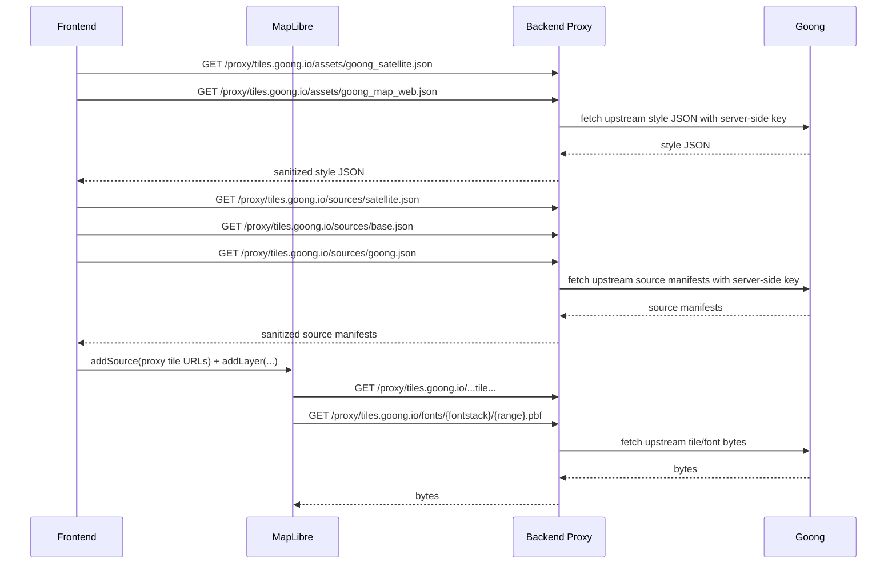
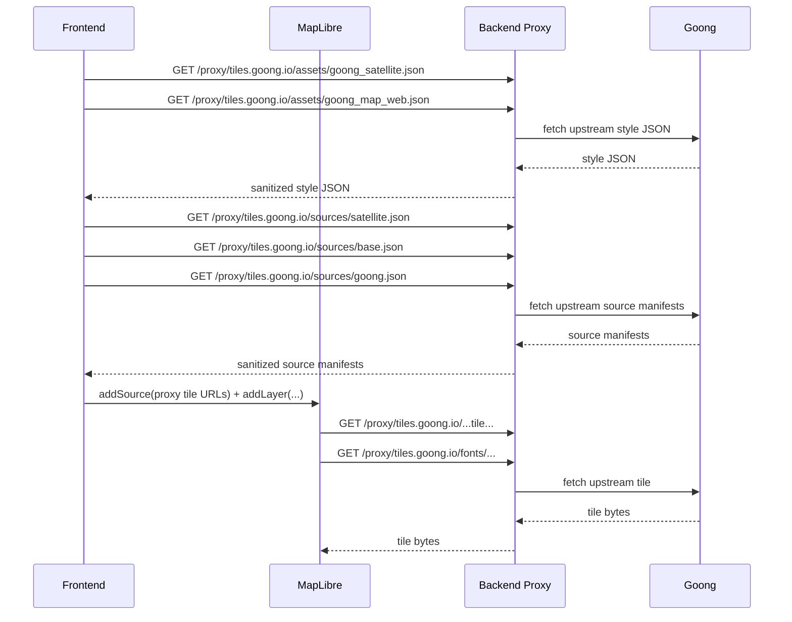

# Goong Proxy Backend Guide

Tài liệu này mô tả:

- luồng request thật của frontend hiện tại
- backend cần proxy chỗ nào
- backend cần sanitize/rewrite chỗ nào
- trade-off hiệu suất nếu proxy toàn bộ Goong
- khuyến nghị triển khai thực dụng cho team BE

Tài liệu liên quan:

- [goong_apis_in_use.md](/home/amoratran/wsp/ultimate-history-map/FrontEndUser/src/uhm/doc/goong_apis_in_use.md)
- [goong_map_web_structure.md](/home/amoratran/wsp/ultimate-history-map/FrontEndUser/src/uhm/doc/goong_map_web_structure.md)
- [goong_satellite_structure.md](/home/amoratran/wsp/ultimate-history-map/FrontEndUser/src/uhm/doc/goong_satellite_structure.md)

Code liên quan:

- [config.ts](/home/amoratran/wsp/ultimate-history-map/FrontEndUser/src/uhm/api/config.ts:1)
- [tiles.ts](/home/amoratran/wsp/ultimate-history-map/FrontEndUser/src/uhm/api/tiles.ts:1)
- [useMapLayers.ts](/home/amoratran/wsp/ultimate-history-map/FrontEndUser/src/uhm/components/map/useMapLayers.ts:1)

## 1. Bối cảnh hiện tại

Frontend hiện tại không `setStyle(goongStyle)` trực tiếp cho MapLibre.

Thay vào đó:

1. FE gọi style JSON qua `buildGoongProxyUrl(...)`
2. FE parse style JSON
3. FE lấy ra:
   - raster source cho satellite
   - selected vector sources/layers cho borders, labels, rivers
4. FE gọi source manifest qua `buildGoongProxyUrl(...)` nếu style source có `url`
5. FE rewrite `tiles[]` về proxy URL rồi `addSource()` và `addLayer()` thủ công
6. MapLibre request tile/font URLs đã là URL proxy

Điểm quan trọng:

- browser không được gọi trực tiếp `tiles.goong.io`
- browser vẫn sẽ đi qua backend proxy ở các tầng:
  - `assets/*.json`
  - `sources/*.json`
  - tile URLs trong `tiles[]`
  - `fonts/{fontstack}/{range}.pbf`

## 2. Luồng request hiện tại

## 3. Mục tiêu của backend proxy

Nếu mục tiêu là:

- không lộ `api_key` ở browser
- vẫn giữ frontend hiện tại gần như nguyên

thì backend phải đảm bảo:

1. browser chỉ gọi domain BE
2. BE gọi Goong bằng key server-side
3. mọi URL Goong lồng bên trong JSON đều được sanitize để không chứa `api_key`
4. frontend nhận URL upstream/relative sạch để tự wrap qua `buildGoongProxyUrl(...)`

Nếu thiếu bước 3:

- `api_key` có thể lộ ngay trong response JSON ở browser devtools

## 4. Những gì cần sanitize/rewrite

### 4.1. Style JSON

Trong `goong_satellite.json` và `goong_map_web.json`, BE cần sanitize:

- `sources.*.url`
- `glyphs`
- `sprite`

Ví dụ:

- từ `https://tiles.goong.io/sources/base.json?api_key=...`
- thành `https://tiles.goong.io/sources/base.json`

Không rewrite sẵn thành `/proxy/...` với frontend hiện tại, vì `tiles.ts` đang tự gọi `buildGoongProxyUrl(...)`.

### 4.2. Source manifests

Trong `sources/satellite.json`, `sources/base.json`, `sources/goong.json`, BE cần sanitize:

- mọi phần tử trong `tiles[]`

Ví dụ:

- từ `https://.../{z}/{x}/{y}...api_key=...`
- thành `https://.../{z}/{x}/{y}...`

Sau đó frontend rewrite URL sạch này về `${API_BASE_URL}/proxy/tiles.goong.io/...`.

### 4.3. Những field còn phải để ý cho flow hiện tại

Với kiến trúc frontend hiện tại:

- `glyphs` đang được FE dùng qua proxy
- `sprite` hiện chưa dùng

Nghĩa là:

- BE **phải** proxy được `fonts/{fontstack}/{range}.pbf`
- BE hiện **chưa cần** proxy `sprite`

Nếu sau này FE chuyển sang `map.setStyle(goongStyleJson)` trực tiếp thì phải đánh giá lại `sprite` ngay.

## 5. Backend endpoint được khuyến nghị

### 5.1. Style endpoints

- `GET /proxy/tiles.goong.io/assets/goong_satellite.json`
- `GET /proxy/tiles.goong.io/assets/goong_map_web.json`

Nhiệm vụ:

- gọi upstream Goong bằng key server-side
- parse JSON
- strip `api_key` khỏi nested URL
- trả JSON đã sanitize, chưa rewrite nested URL sang `/proxy/...`

### 5.2. Source endpoints

- `GET /proxy/tiles.goong.io/sources/satellite.json`
- `GET /proxy/tiles.goong.io/sources/base.json`
- `GET /proxy/tiles.goong.io/sources/goong.json`

Nhiệm vụ:

- gọi upstream Goong bằng key server-side
- parse JSON
- strip `api_key` khỏi `tiles[]`
- giữ URL upstream/relative để frontend tự wrap bằng `buildGoongProxyUrl(...)`
- giữ nguyên:
  - `bounds`
  - `minzoom`
  - `maxzoom`
  - `scheme`
  - `tileSize`
  - `attribution`

### 5.3. Tile endpoint

Route generic frontend hiện build:

- `GET /proxy/tiles.goong.io/...`

Nhiệm vụ:

- nhận tile request từ browser
- map sang upstream tile URL tương ứng
- gọi Goong bằng key server-side nếu upstream yêu cầu
- stream response về browser

Điểm quan trọng:

- tile response không nên parse lại
- tile response nên stream/pass-through
- giữ cache headers càng nhiều càng tốt

## 6. Luồng request sau khi proxy

## 7. Trade-off hiệu suất

### 7.1. Sanitize JSON có chậm không?

Có overhead, nhưng **rất nhỏ** so với tile traffic.

JSON cần sanitize hiện tại chỉ gồm:

- 2 style JSON
- 3 source manifests

Những file này nhỏ, số lượng ít, và có thể cache rất mạnh.

Kết luận:

- sanitize JSON không phải bottleneck chính

### 7.2. Tile proxy mới là chỗ đắt

Chi phí hiệu suất chính nằm ở:

- mọi tile phải đi qua backend
- backend phải giữ thêm một hop mạng
- mất lợi thế gọi trực tiếp CDN của Goong từ browser

Các ảnh hưởng có thể thấy:

- tăng latency
- tăng bandwidth qua BE
- tăng CPU/memory nếu BE buffer response thay vì stream
- tăng load connection pool tới Goong

### 7.3. Nếu không proxy tile/font URL

Nếu BE chỉ proxy style/source JSON nhưng thiếu tile/font route:

- MapLibre request tile/font proxy URL sẽ lỗi
- hoặc nếu FE bị đổi để dùng URL upstream trực tiếp thì browser sẽ gọi Goong và có thể lộ key

Tức là:

- tile/font route vẫn là phần bắt buộc nếu muốn giữ kiến trúc hiện tại

## 8. Cách giảm thiểu impact hiệu suất

### 8.1. Cache sanitized JSON ở BE

Khuyến nghị:

- cache in-memory hoặc Redis cho:
  - `goong_satellite.json`
  - `goong_map_web.json`
  - `sources/satellite.json`
  - `sources/base.json`
  - `sources/goong.json`

TTL có thể dài vì:

- style/source manifest không đổi liên tục

Tối ưu:

- chỉ sanitize một lần rồi reuse

### 8.2. Stream tile response

Cho tile route:

- không parse body
- không buffer toàn bộ file vào memory nếu không cần
- stream thẳng upstream -> client

### 8.3. Preserve cache headers

Với tile route, BE nên pass-through hoặc preserve:

- `Cache-Control`
- `ETag`
- `Last-Modified`
- `Content-Type`

Nếu BE/ngược phía CDN có cache tốt, impact sẽ giảm rất nhiều.

### 8.4. Dùng CDN/reverse proxy trước BE nếu có thể

Nếu production có CDN/nginx/edge cache:

- cache mạnh cho:
  - sanitized style JSON
  - sanitized source manifests
  - tile responses

Điều này quan trọng hơn tối ưu code sanitize.

### 8.5. Đừng parse manifest ở mỗi tile request

Nên:

- sanitize source manifest một lần rồi cache
- tile route chỉ resolve target path đơn giản và forward

Không nên:

- parse lại manifest ở mỗi tile request

## 9. Recommendation thực dụng

Nếu team BE muốn giải pháp cân bằng giữa bảo mật và hiệu suất:

### Option A. Full proxy, sanitize JSON

BE cover:

1. style JSON
2. source manifests
3. tiles
4. fonts/glyphs

Ưu điểm:

- key không lộ ra browser
- FE vẫn dùng upstream target path sạch rồi tự wrap proxy URL

Nhược điểm:

- BE chịu toàn bộ traffic tile

### Option B. Hybrid

BE cover:

1. style JSON
2. source manifests

Nhưng để tile/font đi trực tiếp upstream.

Ưu điểm:

- BE nhẹ hơn

Nhược điểm:

- key vẫn lộ ở tile request
- không khớp với code hiện tại nếu `buildGoongProxyUrl(...)` vẫn được dùng cho tile/font

Kết luận:

- nếu ưu tiên bảo mật key thật sự: dùng **Option A**
- nếu ưu tiên hiệu suất hơn và chấp nhận domain restrictions của Goong: **Option B cần đổi frontend**

## 10. Recommendation cho codebase hiện tại

Với frontend hiện tại, hướng hợp lý nhất là:

1. giữ nguyên FE logic parse style/source như hiện nay
2. giữ `config.ts` dùng upstream URL sạch rồi để `buildGoongProxyUrl(...)` wrap thành `${API_BASE_URL}/proxy/tiles.goong.io/...`
3. để BE sanitize nested `api_key` trong style/source JSON, nhưng không rewrite nested URL thành `/proxy/...`
4. để BE stream tile/font response
5. cache sanitized JSON ở BE

Nói ngắn:

- sanitize JSON: bắt buộc để không lộ key trong response
- FE rewrite tile URLs bằng `buildGoongProxyUrl(...)`
- proxy tile: phần tốn hiệu suất nhất
- muốn bù hiệu suất: phải dùng cache/stream/CDN tốt

## 11. Checklist cho team BE

1. Tạo route proxy cho 2 style JSON
2. Tạo route proxy cho 3 source manifests
3. Strip `api_key` khỏi nested URL trong style JSON
4. Strip `api_key` khỏi `tiles[]` trong source manifests
5. Tạo route proxy tile generic
6. Tạo route proxy fonts/glyphs
7. Stream tile/font response
8. Preserve cache headers
9. Cache sanitized JSON
10. Kiểm tra browser không còn request trực tiếp `tiles.goong.io`
