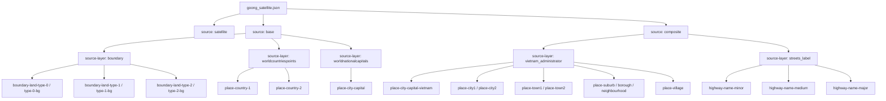

# Goong Satellite Structure

Nguồn JSON gốc được tải về tại:

- `FrontEndUser/tmp/goong-styles/goong_satellite.json`

File này là style satellite. Nó vẫn có boundary và labels, nhưng ít lớp nước hơn `goong_map_web.json`.

## Mermaid overview

## Boundary layers

Các layer boundary nổi bật:

- `boundary-land-type-0-bg`
- `boundary-land-type-0`
- `boundary-land-type-1-bg`
- `boundary-land-type-1`
- `boundary-land-type-2-bg`
- `boundary-land-type-2`

Minzoom quan sát được:

- `type-0`: từ zoom `1`
- `type-1`: từ zoom `5`
- `type-2-bg`: từ zoom `7`
- `type-2`: từ zoom `7`

## Place labels

Labels hữu ích:

- `place-country-1`
- `place-country-2`
- `place-city-capital`
- `place-city-capital-vietnam`
- `place-city1`
- `place-city2`
- `place-town1`
- `place-town2`

Labels dễ gây rối:

- `highway-name-*`
- `place-suburb*`
- `place-neighbourhood*`
- `place-village`

## Khác biệt thực dụng so với goong_map_web

- Có `source: satellite`
- Boundary vẫn hiện diện rõ
- Labels hành chính vẫn có
- Không lộ ra nhóm water chi tiết rõ như `goong_map_web`
- Phù hợp làm raster/satellite nền hơn là style để dò water layers

## Gợi ý dùng thực tế

- Dùng `goong_satellite.json` cho nền satellite
- Dùng `goong_map_web.json` để dò:
  - water
  - water labels
  - boundary theo cấp
  - labels hành chính
