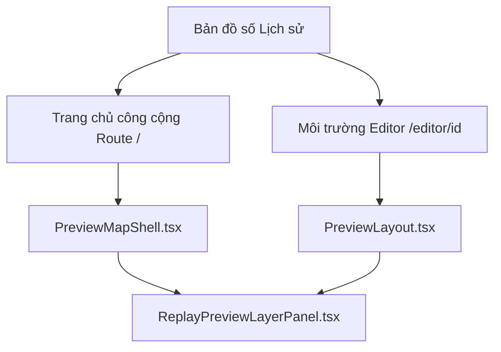

# Hướng Dẫn Phân Chia Tính Năng Giữa Route Trang Chủ `/` Và Editor Preview Mode

Tài liệu này làm rõ sự khác biệt kiến trúc, cấu trúc tệp tin, phân chia trách nhiệm và các lưu ý kỹ thuật khi phát triển/chỉnh sửa tính năng giữa trang bản đồ tổng quan công cộng (Route `/`) và Chế độ xem trước của Trình biên tập (Editor Preview Mode).

---

## 1. Bản Đồ Tổng Quan Kiến Trúc (Architecture Map)

Hệ thống có hai môi trường tương tác bản đồ độc lập sử dụng chung một số thành phần lõi:



### 1.1 Môi trường Trang Chủ công cộng (Route `/`)
* **Tệp tin chính**: `src/app/page.tsx`
* **Vỏ bọc bố cục (Shell Component)**: `src/uhm/components/preview/PreviewMapShell.tsx`
* **Mục đích**: Dành cho khách vãng lai khám phá bản đồ lịch sử thế giới công cộng, tra cứu địa danh lịch sử, chạy thử các replay được xuất bản công khai.
* **Đặc trưng**:
  * Chứa thanh tìm kiếm `PresentPlaceSearch` nằm ở vị trí tuyệt đối (`left: 80px`, `top: 10px`).
  * Có **Menu Cài đặt** gấp gọn ở góc trên bên trái, cung cấp 3 liên kết nhanh: Quản trị & Chỉnh sửa (`/user`), Hỏi đáp (`/faq`), và Giới thiệu (`/about-us`).
  * Trạng thái dòng thời gian (`timelineYear`) mặc định là **1000** và được đồng bộ tự động với `localStorage` (`timeline-year`).

### 1.2 Môi trường Xem trước của Trình biên tập (Editor Preview Mode)
* **Tệp tin chính**: `src/app/editor/[id]/page.tsx`
* **Vỏ bọc bố cục**: `src/uhm/components/preview/PreviewLayout.tsx`
* **Mục đích**: Dành cho Nhà sử học / Người biên tập xem trước bản nháp (snapshot draft) của dự án hiện tại trước khi commit hoặc nộp lên hệ thống.
* **Đặc trưng**:
  * Tích hợp sâu vào Zustand Store (`useEditorStore`) để chia sẻ trạng thái chỉnh sửa hình học, liên kết thực thể (entity binding), và cấu hình replay.
  * Hỗ trợ nút chuyển đổi dữ liệu cục bộ/toàn cầu (Local/Global View Mode) và đồng bộ tọa độ camera của trình chỉnh sửa.

---

## 2. Quy Tắc Phân Chia Tính Năng & Trách Nhiệm

Để tránh phá vỡ giao diện hoặc logic của môi trường còn lại khi chỉnh sửa, các Agent hoặc Developer cần tuân thủ quy tắc sau:

| Tính năng / Thành phần | Trang chủ (Route `/`) | Editor Preview | Lưu ý sửa đổi |
| :--- | :--- | :--- | :--- |
| **Thanh Tìm kiếm (`PresentPlaceSearch`)** | Khai báo tuyệt đối trực tiếp tại `src/app/page.tsx` | Khai báo bên trong `PreviewLayout.tsx` | Đảm bảo chiều rộng linh hoạt bằng cách sử dụng `min-width` / `max-width` thích hợp. |
| **Menu Cài đặt (Bánh răng)** | Nằm tại `PreviewMapShell.tsx` (chứa 3 link: Edit, FAQ, About Us) | Không hiển thị | Menu này chỉ phục vụ điều hướng công cộng. |
| **Layer Control Panel** | Nằm bên trong `PreviewMapShell.tsx` | Nằm bên trong `PreviewLayout.tsx` | Dùng component chung `ReplayPreviewLayerPanel.tsx`. |
| **Trạng thái Timeline** | Mặc định năm 1000, tự động tải/lưu qua `localStorage` | Không lưu `localStorage` (theo trạng thái nháp) | Chỉ áp dụng logic lưu trữ tại `src/app/page.tsx`. |
| **Bộ lọc Timeline (Toggle switch)** | Không hiển thị | Hiển thị và hoạt động trên cả hai chế độ (soạn thảo bình thường và xem trước) | Đảm bảo bộ lọc hoạt động đồng bộ với thực thể nháp (local draft). Tránh áp dụng lọc/truy vấn cho thực thể toàn cầu (global geometries) để không gây DDoS cho API backend. |

---

## 3. Các Cơ Chế Kỹ Thuật Đặc Biệt (Lưu ý cho các Agent khác)

### 3.1 Cơ chế chống Hydration Mismatch & Race Condition khi dùng `localStorage`
Tại Route `/`, `timelineYear` được lưu trong `localStorage`. Do Next.js chạy SSR trên server (nơi không có `window` và `localStorage`), ta phải xử lý tránh lệch HTML bằng cách:
1. Khởi tạo state bằng giá trị tĩnh (`1000`) trên cả server và client.
2. Dùng một `useEffect` chạy khi mount trên client để đọc dữ liệu từ `localStorage` ra nếu có.
3. Dùng một `useRef(true)` làm cờ hiệu `isFirstMount` để ngăn chặn `useEffect` ghi đè giá trị mặc định `1000` vào `localStorage` trước khi client kịp đọc dữ liệu cũ ra:

```typescript
const isFirstMount = useRef(true);

// 1. Đọc dữ liệu khi mount
useEffect(() => {
    if (typeof window !== "undefined") {
        const saved = localStorage.getItem("timeline-year");
        if (saved) {
            const parsed = parseInt(saved, 10);
            if (!isNaN(parsed)) {
                setTimelineYear(parsed);
                setTimelineDraftYear(parsed);
            }
        }
    }
}, []);

// 2. Ghi đè dữ liệu khi người dùng kéo thay đổi mốc năm
useEffect(() => {
    if (isFirstMount.current) {
        isFirstMount.current = false;
        return;
    }
    if (typeof window !== "undefined") {
        localStorage.setItem("timeline-year", String(timelineYear));
    }
}, [timelineYear]);
```

### 3.2 Cơ chế Bố cục Flexbox của Sidebar góc trái
Thanh công cụ bên trái của trang chủ chứa cả **Menu Cài đặt** và **Layer Control Panel**. Để đảm bảo chúng không bao giờ đè lên nhau trên các màn hình có chiều cao thấp:
* Sử dụng một container `<aside>` định vị tuyệt đối với thuộc tính flex dọc (`display: flex`, `flexDirection: column`, `height` giới hạn trong viewport).
* Đặt thuộc tính `flexShrink: 1` và `minHeight: 0` cho vùng bao bọc `ReplayPreviewLayerPanel`.
* Tại `ReplayPreviewLayerPanel.tsx`, thuộc tính `maxHeight` của thẻ bọc chính được thiết lập là `100%` và `overflowY: "auto"`.
* **Kết quả**: Khi Menu Cài đặt mở rộng các nút tùy chọn xuống dưới, Layer Control Panel bên dưới sẽ tự động co nhỏ lại tương ứng và xuất hiện thanh cuộn nếu danh sách các lớp bản đồ vượt quá chiều cao còn lại.

### 3.3 Cơ chế Tự Động Co Giãn cho TimelineBar
Để thanh Timeline kéo dài tối đa chiều ngang nhưng không bị đè bởi Layer Control Panel (ở bên trái) và Wiki Sidebar (ở bên phải) khi mở rộng:
* Thuộc tính `left` được đặt cố định là `"88px"` để luôn đứng cách bên phải Layer Control Panel một khoảng an toàn (18px lề + 58px chiều rộng panel + 12px padding).
* Thuộc tính `right` được tính toán động thông qua hàm `useMemo`:
  * **Khi đóng Sidebar**: `right` bằng `18px`.
  * **Khi mở Sidebar**: `right` bằng `${sidebarWidth + 32}px`.
* Bằng cách đặt cả hai neo `left` và `right` mà không thiết lập `width` cố định hay `maxWidth`, trình duyệt sẽ tự động co giãn thanh Timeline giống như một phần tử `flex: 1` nằm giữa hai bên.
* Đồng thời thêm thuộc tính hiệu ứng `transition: "right 0.3s, left 0.3s"` giúp việc co giãn diễn ra mượt mà cùng tốc độ với thanh Sidebar.

---

## 4. Checklist Khi Chỉnh Sửa Cho Các Agent Tiếp Theo

* [ ] **Chỉnh sửa UI Sidebar / Layer Panel**: Đảm bảo kiểm tra giao diện trên cả màn hình desktop rộng và màn hình laptop/tablet có chiều cao nhỏ.
* [ ] **Sử dụng `localStorage`**: Tuyệt đối không đọc trực tiếp `localStorage` trong hàm khởi tạo `useState(() => localStorage.getItem(...))` vì sẽ gây ra lỗi Hydration Mismatch của Next.js SSR. Hãy luôn khởi tạo bằng giá trị tĩnh và cập nhật lại trong `useEffect` sau khi trang đã mount.
* [ ] **Cập nhật Style**: Sử dụng hệ thống Tailwind CSS có sẵn hoặc các thuộc tính inline CSS an toàn. Hạn chế tối đa việc ghi đè trực tiếp các lớp CSS toàn cục có thể ảnh hưởng xuyên suốt cả dự án.
* [ ] **Kiểm tra bộ lọc Timeline (Timeline Filter)**: Đảm bảo nút bật/tắt bộ lọc ở bên trái Timeline hoạt động chính xác trong cả chế độ soạn thảo bình thường và các chế độ Xem trước (chỉ trừ Replay Preview khi dòng thời gian bị khóa cứng theo replay). Khi bật bộ lọc, các hình học nháp (local draft) phải được lọc đồng bộ theo mốc năm đang hiển thị. Tuyệt đối không gộp/lọc các thực thể toàn cầu (global geometries) để tránh gọi API nặng nề gây DDoS cho backend.
* [ ] **Đảm bảo TypeScript xanh**: Luôn kiểm tra build bằng lệnh `npx tsc --noEmit` trước khi hoàn tất công việc để chắc chắn không xảy ra lỗi kiểu dữ liệu hoặc import sai đường dẫn tương đối.
